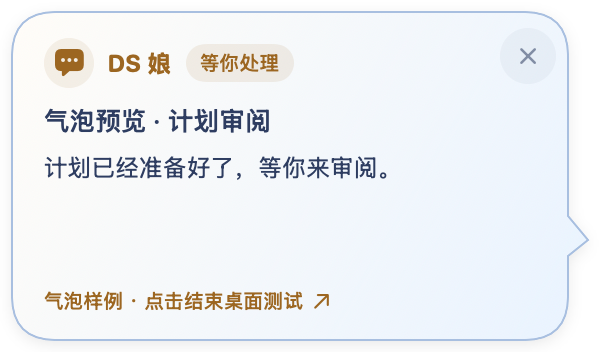
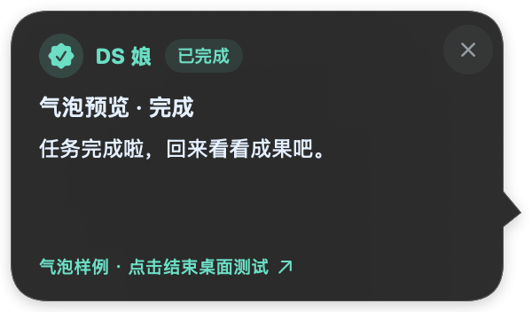

# DSH Always On

让 DeepSeek Harness 的后台任务进展，及时来到你身边。

一个原生 macOS 通知伴侣，内置 DSH 集成。提供“任务通知伙伴”和“纯桌宠陪伴”：前者用动作、气泡通知后台任务，后者无需 DSH，在九个现有动作之间随机或固定表演。

<p align="center"></p>

## 下载与安装

在 [Releases](https://github.com/cfyofjackie/dsh-always-on/releases) 下载 **Apple Silicon DMG**，打开后把 App 拖到「应用程序」。用户只安装一个 App，无需单独安装插件或 Node.js。

- macOS 14 或更高版本，M 系列 Mac。
- 任务通知伙伴需要 **DeepSeek Harness 0.2.0-rc.2**；其他 DSH 版本尚待验证。纯桌宠无需安装 DSH。
- 第一次打开可选择用途；任务通知伙伴需点击「启用集成」并等待连接，纯桌宠可直接使用。
- 已启用旧集成的用户可点「更新集成」，在方便时重开 DSH，让新插件生效。App 不会结束正在运行的任务。

公开下载仍为 **v0.1.0 试用预发布**；当前源码与本地新构建为 **0.2.0 / 20261008.1**，尚未推送或发布。均采用本地临时签名，尚未完成 Apple 公证。若首次打开被系统阻止，按系统提示核对来源并反馈提示，不需要关闭系统安全功能。

## 已有功能

- **任务通知伙伴**：DS 娘五种基础状态、气泡、会话列表、拖动、边缘吸附与位置保存。
- **纯桌宠陪伴**：九个现有动作随机切换且不连续重复，也可固定动作；不生成任务提醒。
- **菜单栏入口**：两种用途均隐藏 Dock，不发送系统任务通知，不申请通知权限。
- **会话跳转**：点击气泡、角色或列表，回到对应 DSH session；回答 / 批准 / 审阅仍在 DSH 中完成。
- **提醒时间**：10 秒、5 秒或一直保留直到打开。
- **外观与测试**：两款气泡、五类内容预览，九动作与对应气泡联合预览、播放 / 暂停 / 从头，以及待机5 / 10秒随机摸鱼。
- **智能提醒与全屏选项**：当前会话完成默认只播放动作；支持三种前台提醒和三种全屏显示策略、锁屏 / 唤醒重连。真实 DSH 和全屏场景仍待完整验收。

<p align="center"> </p>

气泡截图是组件渲染样例。当前形象使用五状态 / 20 帧，并包含认可的吃饭24姿势、扔小鲸鱼23姿势、摸头开心8姿势与摸小鲸鱼24姿势，待机后随机演一轮；旧实验室、归档和 Godot 工作素材不包含在公开仓库中。运行所需的已选素材位于 `macos/Resources/characters/`。

## 当前边界

首发面向愿意反馈的体验用户。Intel / Universal、正式签名公证、自动更新及真实 DSH 前台 / 全屏 / 多显示器场景尚未完成验收。2026-10-08 已取消原生任务通知与 DSH 本体 Dock 角标目标；全屏完全隐藏时没有系统通知兜底。详细说明见 [使用说明](docs/使用说明.md) 和 [验证记录](docs/VALIDATION.md)。

项目仅观察任务和处理会话定位，不读取 DSH 凭据，不自动回答问题或批准操作。提醒保存标题、状态和简短摘要，不保存完整对话或工具参数。

## 从源码构建

开发依赖：Xcode 27 / Swift 6.4+、Node.js 24+。这些仅为开发依赖，安装 DMG 的用户不需要准备。

```sh
cd plugin
npm ci
cd ..
```

打开 `macos/DSHAlwaysOn.xcodeproj`，选择 **DSH Always On / My Mac**，⌘R 运行，⌘U 测试。也可在项目根目录执行：

```sh
bash scripts/build-app.sh
bash scripts/build-dmg.sh
```

生产图集和状态清单已包含，构建不依赖旧实验室。构建产物位于 `dist/`，不进入 Git。详见 [Xcode 开发](docs/Xcode开发.md)。

```sh
swift test --package-path macos
npm --prefix plugin run check
npm --prefix plugin test
```

当前 51 项 Swift 核心测试、32 项 Node 测试；Xcode 与 Swift Package 运行同一套核心检查。

## 项目结构

- `macos/`：原生客户端、共享核心、生产素材和 Xcode 工程。
- `plugin/`：TypeScript / Cordis host、client 与本地桥接。
- `scripts/`：构建、插件嵌入、打包和素材导出。
- `docs/`：产品定义、协议、使用说明、验证边界和协作记录。

[PRD](docs/PRD.md) · [架构](docs/ARCHITECTURE.md) · [事件协议](docs/EVENTS.md)

如遇问题，可在 [Issues](https://github.com/cfyofjackie/dsh-always-on/issues) 留下系统版本、芯片、DSH 版本和复现步骤；截图请遮住私人内容。本项目是独立伴侣工具，不是 DeepSeek 官方客户端。
